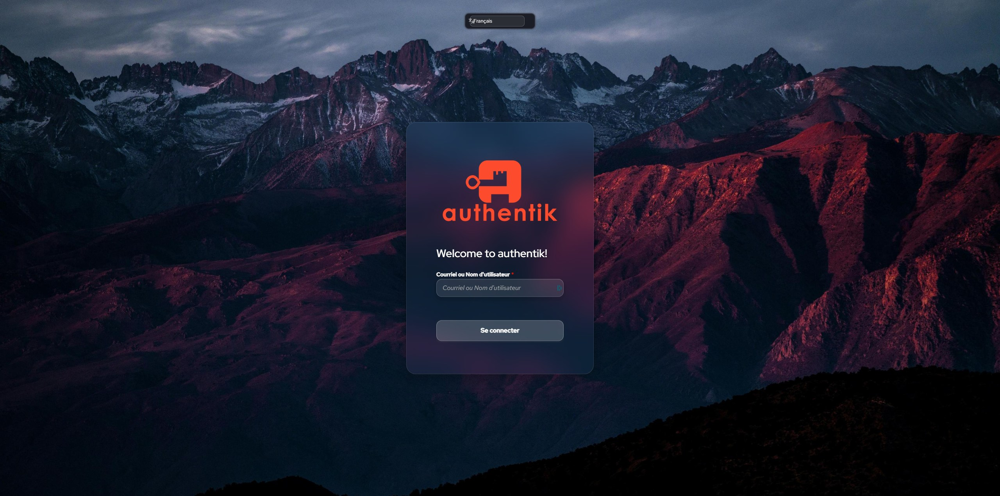
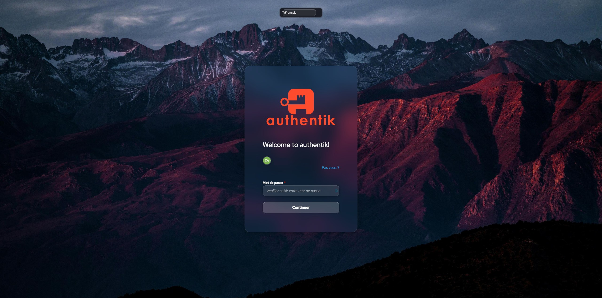
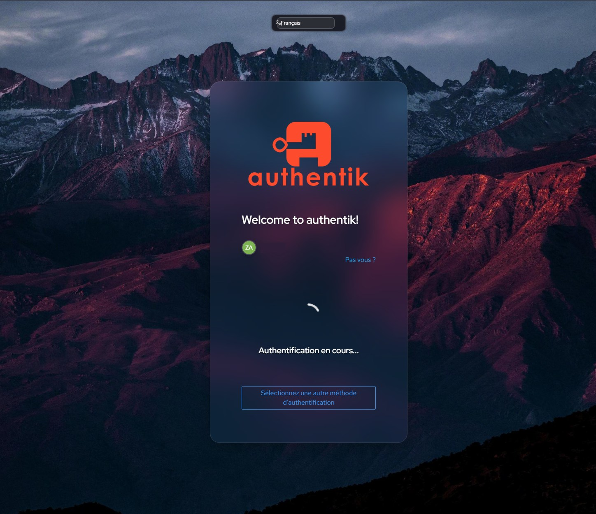
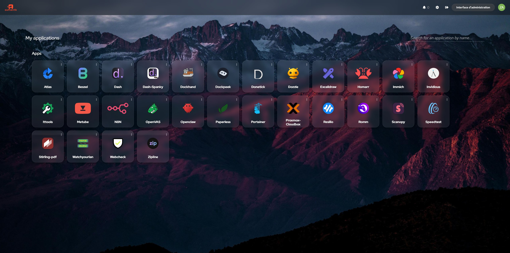
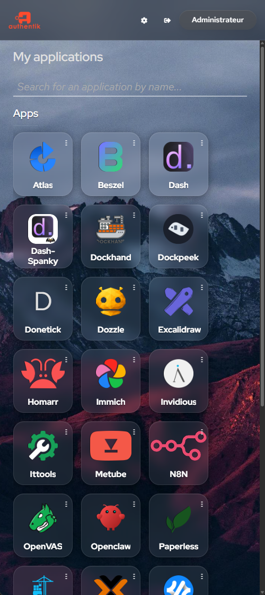

# Authentik Login-theme: Glassmorphism ✨ (2026.x fork)

A custom **glassmorphism** login theme for [Authentik](https://goauthentik.io/).

> ✅ **V3.1** — Tested and fully compatible with **Authentik 2026.2.3**
>
> Forked from the original [VULGA01/Authentik-Login-theme-Glassmorphism](https://github.com/VULGA01/Authentik-Login-theme-Glassmorphism) (tested on 2025.10.3) and updated for the new Shadow DOM architecture introduced in Authentik 2026.x.

[](LICENSE)


## 📸 Previews

### Login — Identification


### Login — Password


### Login — MFA (WebAuthn)


### Application Dashboard (desktop)


### Application Dashboard (mobile)


## ✅ Compatibility

| Authentik version | Status | Notes |
|---|---|---|
| **2026.2.3** | ✅ Fully tested | This fork — V3.1 |
| 2026.x (other minor) | 🟢 Likely OK | Same Shadow DOM architecture |
| 2025.10.3 | 🟡 Use V3.0 from [original repo](https://github.com/VULGA01/Authentik-Login-theme-Glassmorphism) | Older DOM structure |
| ≤ 2025.x earlier | 🟡 Use V3.0 from [original repo](https://github.com/VULGA01/Authentik-Login-theme-Glassmorphism) | Older DOM structure |

## ✨ Features (V3.1)

- **Modern glassmorphism design** — `backdrop-filter` blur, semi-transparent glass cards, elegant shadows.
- **Full responsiveness** — Optimized for desktop, tablet, and mobile (including iOS quirks).
- **Authentik 2026.x Shadow DOM support** — Targets new components via CSS Shadow Parts:
  - `<ak-flow-card>` — new wrapper around every login stage
  - `<ak-form-static>` — avatar + username block
  - `<ak-flow-input-password>` — new password wrapper
  - `<ak-locale-select>` — language picker
  - `<ak-tabs vertical>` — vertical tabs in user settings
  - `<ak-empty-state>` — loading states
  - `pf-m-block` / `pf-m-icon` button/input variants
- **Centered locale picker** — Always centered horizontally at the top, all viewport sizes.
- **No-scroll login flow** — Login box viewport-locked with internal scroll only.
- **User settings + dashboard theming** — Tabs, tables, app cards consistent glass styling.
- **Themed app card actions** — The `⋮` dropdown menu on each app is glass-styled.
- **Static error pages** — "Client ID Error" and other static error pages also themed.
- **Admin panel safe** — Specific styling isolation keeps the admin interface untouched.
- **Easy customization** — Simple CSS variables at the top of `theme.css`.

## 🚀 Installation

1. Clone or download this repository (or just grab `theme.css`).
2. In Authentik Admin Interface, go to:
   **Admin → System → Brands → Choose your brand → Brand settings → Custom CSS**
3. Paste the contents of `theme.css` into the Custom CSS field.
4. Save and refresh the login page (Ctrl+Shift+R for hard refresh).

## 🎨 Customization

Open `theme.css` and edit these variables at the top:

```css
:root {
    --ak-flow-background: url(https://your-image.jpg);     /* Background image */
    --ak-social-separator-text: "Continuer avec";          /* Separator text */
    --ak-accent: #d0ced0;                                  /* Accent color */
}
```

You can also use a local image by hosting it on your Authentik instance (e.g. via
`/static/dist/assets/images/...`) and pointing the variable to that URL.

## ⚠️ Cloudflare Notice

If you're using **Cloudflare** with a **proxied domain**, you might experience issues
due to cached CSS. 👉 **Purge your Cloudflare cache** to ensure changes take effect.

## 🐛 Known Limitations

A few elements remain unstyled because they live inside deeply nested Shadow DOMs
without exposed CSS parts, and Authentik doesn't propagate the Brand Custom CSS into
every shadow root:

- The native `<select>` dropdown menu of the locale picker (browser-rendered)
- The `<datalist>` autocomplete dropdown of the app search bar (browser-rendered)
- The `<pf-tooltip>` content text (no part exposed; CSS variables used as best-effort)
- The "Pas vous ?" link inside `<ak-form-static>` (no part exposed)

For these, only a JavaScript injection or an upstream PR to Authentik could fix them.

## 📜 Changelog

See [CHANGELOG.md](./CHANGELOG.md) for the full version history.

### Summary of V3.1 vs V3.0

- 🔴 **Bugs fixed**: 3 invalid `:contains()` rules + 1 broken CSS block + brace imbalance
- 🟠 **Dead code removed**: 9 duplicate rule groups, 4 non-existent host selectors
- 🟢 **2026.x components added**: ~25 new `::part()` routes for new Shadow DOM components
- 🟢 **Static error pages themed** (Client ID Error, Permission Denied, etc.)
- 🟢 **CSS variables at `:root`** to pierce shadow boundaries (form controls, tables, tooltips)
- 🟢 **Stats**: 2273 → ~3180 lines · brace balance 180/182 ❌ → 266/266 ✅

## 🧑‍🎨 Credits

- **Original theme**: designed by [**VULGA**](https://github.com/VULGA01) — see the [original repository](https://github.com/VULGA01/Authentik-Login-theme-Glassmorphism).
- **2026.x compatibility fork**: maintained here with audit, cleanup, and new Shadow DOM component support.

## 🔓 License

This project is open source and freely available under the **MIT License** (inherited
from the original). You can **use, share, and modify** it without restriction.

---

> Original work by [VULGA](https://github.com/VULGA01) ❤️ — 2026.x fork maintained for community.
